# Siamese-MicroPerf

Siamese-MicroPerf 是一个面向编译优化效果预测的性能建模项目。它通过采集程序运行时的 PMU 计数器和 LBR 分支轨迹，构造时序特征，再使用 Siamese 网络预测两个二进制版本之间的相对性能差异。

当前仓库同时包含两部分能力：

- 一个 Linux PMU 采样器 `pmu_monitor`，负责按固定时间间隔采集硬件事件。
- 一套 Python 训练与推理流水线，负责从采样日志构建张量、训练模型并做性能对比预测。

项目默认面向 LLVM test-suite 及其不同编译/后链接优化变体，例如 O1-g、O3-g、O2-bolt、O2-bolt-opt、O3-bolt、O3-bolt-opt。

## 项目目标

给定同一程序的两个版本 `v1` 和 `v2`，模型输出一个连续值 `Y_hat`。这个标签有三种物理定义，取决于数据集构建模式：

- 固定时间机制：`Y = N_v1 / N_v2`，表示固定时间窗口内的吞吐量倍率
- 固定工作量机制：`Y = T_v2 / T_v1`，表示完成同等工作量时的耗时倍率
- 退役指令总数机制：`Y = Σinst_v1 / Σinst_v2`，表示固定时间窗口内退役指令总数之比

三种机制的统一说明见 [docs/label-mechanisms.md](docs/label-mechanisms.md)。

三种模式的物理含义不同，但判定方向一致：

- `Y_hat > 1.0`：模型判断 `v1` 更快
- `Y_hat < 1.0`：模型判断 `v2` 更快
- 推理脚本输出结论时使用 `Y_hat > 1.05` / `Y_hat < 0.95` 作为快慢判定阈值
- 当 `0.95 <= Y_hat <= 1.05` 时，推理脚本会把结果视为近似持平

这个设计适合用于回答类似问题：

- 某个 BOLT 优化版本是否真的比基线更快
- 不同编译选项是否带来了稳定的微架构收益
- 仅从 PMU/LBR 行为能否预测程序版本间的相对速度关系

## 核心组成

### 1. PMU 采集器

`pmu_monitor` 由 C 代码实现，负责周期性采集：

- `inst_retired.any`
- `L1-icache-load-misses`
- `iTLB-loads`
- `iTLB-load-misses`
- `branch-instructions`
- `branch-misses`
- LBR 统计特征 `lbr_avg_span` / `lbr_log1p_span`

它支持：

- 指定 PID 监控
- 全系统模式
- 自定义采样间隔
- `-T` 线程跟踪模式，用于为新线程挂载 LBR 采样
- `-E` 输出 `time_enabled` / `time_running` 字段

输出会写到 `log/pmu_monitor_*.csv`，并维护软链接 `log/pmu_monitor.csv` 指向最新文件。

### 2. 特征工程

Python 侧会把原始计数器转换为模型可用的时序特征：

- 5 个 PMU 事件转换为 MPKI
- 1 个 LBR 特征 `lbr_log1p_span`
- 序列统一为时间步 `T`
- 默认做全局 Z-score 标准化

最终每个样本的输入维度为 6 个特征。

### 3. 模型结构

模型定义在 `python/model_cnn.py`、`python/model_lstm.py`、`python/model_transformer.py`，并由 `python/model_factory.py` 统一分发。当前支持三种主干：

- CNN: Siamese 1D-CNN + Attention Pooling
- LSTM: Siamese Bidirectional LSTM + Attention Pooling
- Transformer: Siamese Transformer Encoder + Attention Pooling

三者都由三部分组成：

- 共享权重的 Backbone（CNN / BiLSTM / Transformer Encoder）
- Mask-aware Attention Pooling
- MLP 回归头

```text
(Seq_v1, Seq_v2) -> Shared Encoder -> Pooling -> [V_v1; V_v2; V_v1 - V_v2] -> MLP -> Continuous Scalar
```

其中各阶段含义为：

- `Seq_v1` / `Seq_v2`：两个程序版本的 PMU/LBR 时序特征序列
- `Shared Encoder`：共享参数的时序编码器，用于把两个版本映射到同一表示空间
- `Pooling`：将时间维隐藏状态压缩为定长向量表示 `V_v1` 和 `V_v2`
- `[V_v1; V_v2; V_v1 - V_v2]`：拼接两个版本的绝对表示和差分表示，显式保留对比信息
- `MLP`：把融合后的对比特征映射到回归输出
- `Continuous Scalar`：最终预测的连续标量 `Y_hat`，表示 `v1` 相对 `v2` 的性能倍率

从整体前向流程看，模型遵循下面这条 Siamese 框架链路：

$$
(S_{v1}, S_{v2}) \rightarrow f_{\theta} \rightarrow \mathrm{Pool}(\cdot) \rightarrow [V_{v1}; V_{v2}; V_{v1} - V_{v2}] \rightarrow g_{\phi} \rightarrow \hat{Y}
$$

对应的结构图如下：

- 内嵌可交互渲染（浏览器打开）：[docs/diagrams/forward_sequence.html](docs/diagrams/forward_sequence.html#L1)
- 文档内使用静态 SVG（点击图片可打开可交互视图）：


其中各阶段含义为：

- $S_{v1}$ 和 $S_{v2}$：两个程序版本对应的 PMU/LBR 时序特征序列
- $f_{\theta}$：共享参数的时序编码器，用于把两个版本映射到同一表示空间
- $\mathrm{Pool}(\cdot)$：时间维聚合算子，将隐藏状态压缩为定长表示 $V_{v1}$ 和 $V_{v2}$
- $[V_{v1}; V_{v2}; V_{v1} - V_{v2}]$：同时保留两个版本的绝对表示与差分表示，以显式编码对比关系
- $g_{\phi}$：MLP 回归头，将融合后的对比特征映射为最终预测值
- $\hat{Y}$：模型输出的连续标量，表示版本 $v1$ 相对版本 $v2$ 的性能倍率预测

更具体地说，两个版本的输入序列先经过同一个共享编码器得到隐藏表示，再通过池化得到向量 $V_{v1}$ 和 $V_{v2}$，最后将它们与差分项一起送入 MLP，输出相对性能倍率预测 $\hat{Y}$。

### 4. 训练与推理

训练脚本 `python/train.py` 负责：

- 加载一组或多组版本对张量
- 划分训练集/验证集
- 默认从 `train_set/tensors/fixed_time` 读取张量，并按标签机制、模型类型、单对数据集自动应用 `auto-tune` 预设
- 使用 Huber Loss 训练模型，并支持 `--log-target`、`--direction-lambda`、`--pair-swap` 等训练增强项
- 通过 `--model` / `--arch` 选择 CNN、LSTM 或 Transformer
- 可通过 `--output-model` 单独指定最佳模型输出位置
- 自动保存最佳检查点到 `checkpoints/best_model.pt`
- 同时把模型结构与训练配置写入 `configs/*.json`，供推理阶段自动恢复

推理脚本 `python/infer.py` 支持两种模式：

- 基于已有 `.pt` 张量批量推理
- 基于两份原始 CSV 做实时特征提取后单次推理
- 模型恢复优先级为 `configs/*.json > checkpoint 元数据`，也可通过 `--config` 显式指定 JSON
- `pair_swap` 只影响训练期数据增强，推理始终按输入顺序 `(v1, v2)` 直接前向

## 仓库结构

```text
.
├── Makefile                     # 编译 pmu_monitor
├── src/                         # PMU / LBR / 输出 / 线程跟踪实现
├── test/                        # C 侧测试工作负载
├── python/                      # 数据集构建、模型、训练、推理、可视化
├── configs/                     # 与 checkpoint 分离保存的模型配置 JSON
├── train_set/                   # 数据采集脚本、manifest、训练张量、变体数据
├── checkpoints/                 # 训练输出模型
├── log/                         # PMU、训练、推理日志
├── docs/                        # 项目设计说明
└── llvm-test-suite/             # 基准测试来源
```

## 环境要求

### 系统要求

- Linux
- 支持 `perf_event_open`
- 支持 LBR（如 Intel Skylake 及以上）
- 建议 x86_64 Linux 主机
- 需要足够权限访问硬件性能计数器

如果 `perf_event_paranoid > 1`，跨进程采样可能失败。常见处理方式：

```bash
echo 1 | sudo tee /proc/sys/kernel/perf_event_paranoid
```

采集脚本通常建议直接使用 `sudo` 运行。

### 编译依赖

- `gcc`
- `make`
- 标准 Linux 开发环境

### Python 依赖

`requirements.txt` 当前包含：

- `numpy`
- `pandas`
- `matplotlib`
- `torch`

训练与推理脚本现在默认使用 `--device auto`，设备优先级为 `directml -> cuda -> cpu`。

如果你希望默认命中 DirectML，需要在支持的平台上额外安装 `torch-directml`：

```bash
pip install torch-directml
```

如果当前环境没有 DirectML，脚本会自动回退到 CUDA 或 CPU；也可以显式传入 `--device directml`、`--device cuda` 或 `--device cpu`。

安装方式：

```bash
python3 -m venv .venv
source .venv/bin/activate
pip install -r requirements.txt
```

## 快速开始

### 1. 编译 PMU 采集器

```bash
make
```

默认会生成可执行文件：

```text
./pmu_monitor
```

### 2. 运行采集器自测

```bash
./test_pmu_monitor.sh
```

这个脚本会：

- 编译 `pmu_monitor`
- 编译测试工作负载 `test/test_workload`
- 启动工作负载并监控
- 检查输出 CSV 是否存在、行数是否合理、时间列是否单调递增

### 3. 使用现有张量直接训练

如果 `train_set/tensors/` 下已经存在构建好的张量，可以直接训练：

```bash
python3 python/train.py --model cnn
```

默认情况下，训练脚本会从 `train_set/tensors/fixed_time` 读取张量，并保持 `--auto-tune` 开启；未显式指定的超参数会按标签机制、模型类型以及单对数据集覆盖成当前实现中的推荐值。

如果你想直接复现仓库里当前保留的一组 Transformer 固定时间实验产物，可以使用下面这条与 `configs/trans_best_time.json` 对齐的命令：

```bash
python3 python/train.py \
  --model transformer \
  --tensor-base train_set/tensors/fixed_time \
  --output-model checkpoints/trans_best_time.pt \
  --epochs 400 \
  --batch-size 64 \
  --lr 3e-4 \
  --weight-decay 5e-4 \
  --huber-delta 0.1 \
  --patience 80 \
  --warmup-epochs 20 \
  --direction-lambda 5.0 \
  --d-model 32 \
  --nhead 2 \
  --num-layers 2 \
  --dim-feedforward 64 \
  --mlp-hidden 32 \
  --dropout 0.2 \
  --log-target
```

这组命令对应当前仓库中已经存在的：

- `checkpoints/trans_best_time.pt`
- `configs/trans_best_time.json`

如果你想把最佳模型输出到其他位置，可以显式指定：

```bash
python3 python/train.py --model cnn \
  --output-model checkpoints/experiments/cnn_best.pt
```

训练输出：

- 最佳模型：`checkpoints/best_model.pt`
- 配置文件：与 checkpoint 对应的 `configs/*.json`
- 日志文件：`log/train_*.log`

### 4. 使用已有模型做推理

```bash
python3 python/infer.py --checkpoint checkpoints/best_model.pt
```

如果你想直接使用仓库内置的 Transformer 固定时间实验结果，推荐显式写出 checkpoint 和配置文件：

```bash
python3 python/infer.py \
  --checkpoint checkpoints/trans_best_time.pt \
  --config configs/trans_best_time.json
```

如果你想显式指定与 checkpoint 对应的配置文件，也可以这样运行：

```bash
python3 python/infer.py \
  --checkpoint checkpoints/best_model.pt \
  --config configs/best_model.json
```

推理输出会写到控制台和 `log/infer_*.log`。

默认情况下，推理脚本会先尝试从 `configs/` 下加载与 checkpoint 同名的 JSON 配置，再回退到 checkpoint 中记录的元信息；也可以通过 `--model` / `--arch`、`--config`、`--log-target` / `--no-log-target` 做显式覆盖。

## 完整数据流水线

如果你希望从 PMU 采集开始完整跑通，可以按下面流程执行。

### 第一步：先构建 llvm-test-suite 源 build 目录

在执行采集脚本前，需要先在 `llvm-test-suite` 中准备好 `generate_train_set.sh` 会提取的构建目录。当前脚本不会自动执行 `cmake` 或 `make`，至少需要提前准备：

- `build-O1-g`
- `build-O3-g`
- `build-O2-bolt`
- `build-O3-bolt`

下面以 `O3-g` 为例说明构建方式：

```bash
cd llvm-test-suite/build-O3-g
cmake -DCMAKE_C_COMPILER=/usr/bin/clang \
  -DCMAKE_CXX_COMPILER=/usr/bin/clang++ \
  -C ../cmake/caches/O3-g.cmake \
  ..
make -j8
```

其他变体可按同样模式生成对应的 `build-<variant>` 目录。更完整的六类变体来源说明见 [docs/hardware-model-dataset.md](docs/hardware-model-dataset.md)。

### 第二步：准备变体二进制并采集 PMU 数据

项目提供了自动脚本：

```bash
cd train_set
sudo ./generate_train_set.sh
```

这个脚本会依次处理：

- `O1-g`
- `O3-g`
- `O2-bolt`
- `O2-bolt-opt`
- `O3-bolt`
- `O3-bolt-opt`

内部调用的关键脚本包括：

- `train_set/extract_elf.sh`
- `train_set/collect_dataset_testbench.sh`
- `train_set/bolt_optimize.sh`

采集产物主要有两类：

- `train_set/data/<variant>/...csv`：每个程序的 PMU 时序
- `train_set/manifest_<variant>.jsonl`：每个程序的元数据和 `run_count`

### 第三步：构建训练张量

#### 固定时间机制

默认机制是固定时间窗口，标签定义为运行次数之比：

```bash
python3 python/build_dataset_fixedtime.py
```

输出目录默认是：

```text
train_set/tensors/fixed_time/
```

每个版本对会生成：

- `X_v1.pt`
- `X_v2.pt`
- `Y.pt`
- `len_v1.pt` / `len_v2.pt`（当前脚本会一并写出；固定时间模式下它们通常等于 `seq_len`）
- `programs.json`
- `stats.json`

此时标签为：

- `Y = N_v1 / N_v2`
- `Y > 1` 表示在同一采样时间内 `v1` 完成了更多工作，因此 `v1` 更快

#### 固定工作量机制

项目还提供固定工作量视角的数据构建脚本：

```bash
python3 python/build_dataset_fixedwork.py
```

输出目录默认是：

```text
train_set/tensors/fixed_work/
```

这个版本会把有效序列长度也作为重要信息保留下来，更适合表达“完成同等工作量所需时间”的差异。

此时标签为：

- `Y = T_v2 / T_v1`
- `Y > 1` 表示 `v2` 耗时更长、`v1` 更快

也就是说，两种模式的标签定义不同，但 `Y > 1` / `Y < 1` 的快慢方向保持一致。

#### 退役指令总数机制

项目还提供基于退役指令总数比的标签构建脚本：

```bash
python3 python/build_dataset_instret.py
```

输出目录默认是：

```text
train_set/tensors/inst_retired/
```

这个版本保持固定时间窗口的输入对齐方式，但将标签从外部 harness 的运行次数比替换为 PMU 硬件事件 `inst_retired.any` 的总和之比。

此时标签为：

- `Y = Σinst_v1 / Σinst_v2`
- `Y > 1` 表示在同一采样时间内 `v1` 退役了更多指令，因此 `v1` 吞吐量更高
- `Y < 1` 表示 `v2` 吞吐量更高

其物理动机是：在固定的 PMU 采样窗口（默认 30 秒）内，CPU 经历的总时钟周期数近似恒定，因此程序完成的退役指令总数可以被视为“工作吞吐量”的直接硬件度量。

### 第四步：训练模型

#### 使用默认固定时间数据训练

```bash
python3 python/train.py --model cnn
```

#### 使用 LSTM 训练

```bash
python3 python/train.py --model lstm
```

#### 使用 Transformer 训练

```bash
python3 python/train.py --model transformer
```

#### 复现当前仓库内置的 Transformer fixed_time 实验

```bash
python3 python/train.py \
  --model transformer \
  --tensor-base train_set/tensors/fixed_time \
  --output-model checkpoints/trans_best_time.pt \
  --epochs 400 \
  --batch-size 64 \
  --lr 3e-4 \
  --weight-decay 5e-4 \
  --huber-delta 0.1 \
  --patience 80 \
  --warmup-epochs 20 \
  --direction-lambda 5.0 \
  --d-model 32 \
  --nhead 2 \
  --num-layers 2 \
  --dim-feedforward 64 \
  --mlp-hidden 32 \
  --dropout 0.2 \
  --log-target
```

#### 使用固定工作量数据训练

```bash
python3 python/train.py --model cnn --tensor-base train_set/tensors/fixed_work
```

#### 使用退役指令总数标签数据训练

```bash
python3 python/train.py --model cnn --tensor-base train_set/tensors/inst_retired
```

#### 只训练指定版本对

```bash
python3 python/train.py --model cnn --pairs O1-g_vs_O3-g
```

#### 只评估已有模型

```bash
python3 python/train.py \
  --model cnn \
  --eval-only \
  --checkpoint checkpoints/best_model.pt
```

常用训练参数（下列是基础 CLI 默认值；默认运行时若开启 `--auto-tune`，未显式指定的参数还会被预设覆盖）：

- `--model` / `--arch`，`cnn`、`lstm` 或 `transformer`
- `--tensor-base`，默认 `train_set/tensors/fixed_time`
- `--epochs`，默认 150
- `--batch-size`，默认 32
- `--lr`，默认 `1e-3`
- `--weight-decay`，默认 `1e-4`
- `--patience`，默认 30
- `--noise-std`，默认 0.05
- `--log-target`，默认关闭
- `--direction-lambda`，默认 0.0
- `--pair-swap`，默认关闭
- `--auto-tune` / `--no-auto-tune`，默认开启自动预设
- `--label-mechanism`，默认 `auto`

LSTM 常用附加参数：

- `--lstm-hidden`，默认 64
- `--lstm-out`，默认 128
- `--num-layers`，默认 3（LSTM 层数，与 Transformer 共用参数名）
- `--bidirectional` / `--no-bidirectional`，默认双向

Transformer 常用附加参数：

- `--d-model`，默认 128
- `--nhead`，默认 4
- `--num-layers`，默认 3
- `--dim-feedforward`，默认 256
- `--pos-encoding`，`learnable` 或 `sinusoidal`

### 第五步：推理与验证

#### 对全部默认版本对推理

```bash
python3 python/infer.py --checkpoint checkpoints/best_model.pt
```

#### 显式指定 Transformer checkpoint 推理

```bash
python3 python/infer.py \
  --checkpoint checkpoints/best_model.pt \
  --model transformer
```

#### 使用仓库内置的 Transformer fixed_time checkpoint 推理

```bash
python3 python/infer.py \
  --checkpoint checkpoints/trans_best_time.pt \
  --config configs/trans_best_time.json
```

#### 对固定工作量张量推理

```bash
python3 python/infer.py \
  --checkpoint checkpoints/best_model.pt \
  --tensor-base train_set/tensors/fixed_work
```

#### 对退役指令总数标签张量推理

```bash
python3 python/infer.py \
  --checkpoint checkpoints/best_model.pt \
  --tensor-base train_set/tensors/inst_retired
```

#### 对指定版本对推理

```bash
python3 python/infer.py \
  --checkpoint checkpoints/best_model.pt \
  --pairs O2-bolt_vs_O2-bolt-opt
```

#### 对两份原始 CSV 直接推理

```bash
python3 python/infer.py \
  --checkpoint checkpoints/best_model.pt \
  --csv-v1 path/to/v1.csv \
  --csv-v2 path/to/v2.csv \
  --stats train_set/tensors/fixed_time/O2-bolt_vs_O2-bolt-opt/stats.json
```

推理时常用参数：

- `--model auto`：优先从 `configs/*.json` 自动恢复模型类型与结构，缺失时再回退 checkpoint 元数据
- `--model cnn`
- `--model lstm`
- `--model transformer`
- `--config`：显式指定模型配置 JSON
- `--log-target` / `--no-log-target`：覆盖输出空间设置
- `--csv-v1` / `--csv-v2` / `--stats`：启用原始 CSV 单次推理模式

需要注意，日志中的“方向准确率”以 `1.0` 为分界统计；面向用户的最终结论展示则使用 `0.95` 到 `1.05` 的近似持平区间。

## `pmu_monitor` 用法

基本用法：

```bash
sudo ./pmu_monitor [PID] [-i interval_ms] [-T] [-E]
```

示例：

```bash
sudo ./pmu_monitor
sudo ./pmu_monitor 12345
sudo ./pmu_monitor 12345 -i 200
sudo ./pmu_monitor 12345 -T
sudo ./pmu_monitor 12345 -E
```

说明：

- 不传 PID 时默认做全系统采样
- `-i` 控制采样周期，默认 `1000 ms`
- `-T` 为新线程单独挂载 LBR 事件，只适用于指定 PID 模式
- `-E` 在 CSV 中额外输出复用修正相关字段

## 默认训练版本对

当前代码默认训练和推理以下 3 组版本对：

- `O1-g_vs_O3-g`
- `O2-bolt_vs_O2-bolt-opt`
- `O3-bolt_vs_O3-bolt-opt`

## 关键输出文件

### 采样阶段

- `log/pmu_monitor_*.csv`
- `train_set/data/<variant>/*.csv`
- `train_set/manifest_<variant>.jsonl`

### 训练阶段

- `checkpoints/best_model.pt`
- `configs/*.json`
- `log/train_*.log`

### 推理阶段

- `log/infer_*.log`

## 已有文档

如果你想看更细的设计说明，可以从这些文档继续阅读：

- [docs](docs/)

## 注意事项

- 该项目强依赖 Linux 性能计数器环境，不能简单移植到无 `perf_event_open` 的平台。
- PMU 采集对系统噪声敏感，训练数据质量很大程度上取决于采集隔离度。
- 固定时间机制、固定工作量机制和退役指令总数机制的标签物理定义不同，但大小方向一致；训练、推理和 `--stats` 必须使用同一机制下生成的产物。
- `train_set/manifest_*.jsonl` 中 `run_count=0` 的样本会在数据构建阶段被跳过。

## 一条最短可运行路径

如果你只是想快速验证训练与推理链路，并且仓库里已经有 `train_set/tensors/fixed_time/`，建议直接执行：

```bash
python3 -m venv .venv
source .venv/bin/activate
pip install -r requirements.txt
python3 python/build_dataset_fixedtime.py
python3 python/train.py --model cnn
python3 python/infer.py --checkpoint checkpoints/best_model.pt --model cnn
```

如果你希望从 PMU 采集开始端到端复现实验，请先按上面的“完整数据流水线”准备 `build-O1-g`、`build-O3-g`、`build-O2-bolt`、`build-O3-bolt`，再运行 `train_set/generate_train_set.sh`。
