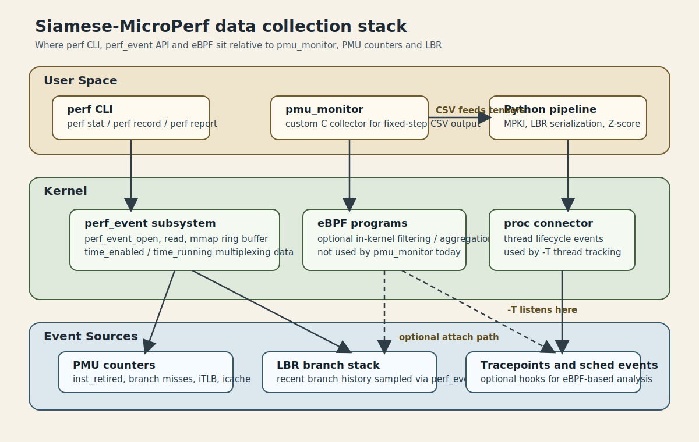
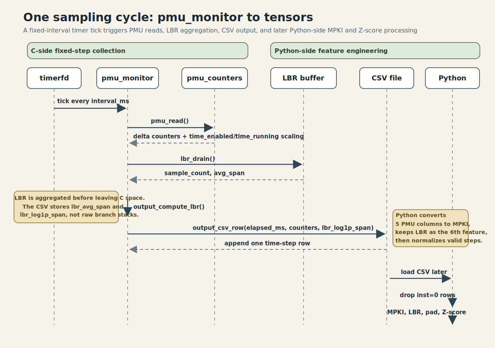
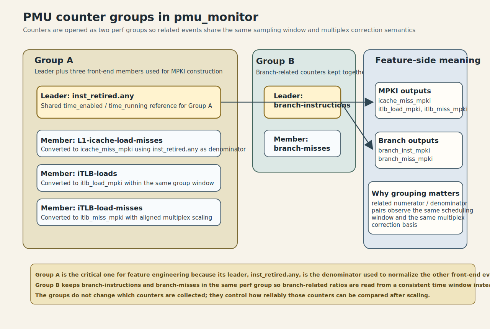
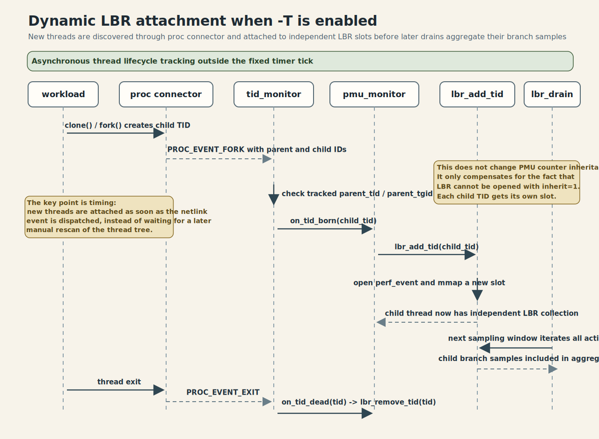

# Data Collection & Feature Engineering

本文补充说明 Siamese-MicroPerf 的两段关键流水线：

1. 轻量级 C 侧采集器 pmu_monitor 如何在固定采样周期内输出对齐的 PMU/LBR 时序。
2. Python 侧如何把原始 CSV 转成可直接送入 Siamese 模型的 6 维时序特征。

文中重点覆盖线程跟踪选项 -T、PMU 到 MPKI 的转换、LBR 序列化，以及 Z-score 标准化。

## 1. 采集目标与整体链路

采集链路分成两层：

- C 侧 pmu_monitor 以固定时间间隔采样，输出 log/pmu_monitor_*.csv。
- Python 侧读取 CSV，把每个时间步映射为统一的特征向量，再按版本对生成张量。

对模型来说，一个样本本质上是两个版本的对齐序列：

$$
X_{v1}, X_{v2} \in \mathbb{R}^{T \times D}
$$

其中：

- $T$ 是时间步长度。
- $D=6$，由 5 个 MPKI 特征和 1 个 LBR 特征组成。

固定时间机制下，默认采样窗口为 30 s、采样周期为 500 ms，因此通常得到约 60 个时间步。

## 2. 轻量级 C 侧采集器 pmu_monitor

pmu_monitor 由 src/main.c 驱动，底层依赖三个模块：

- src/pmu_counters.c：负责基础 PMU 计数器。
- src/lbr.c：负责 LBR branch stack 采样与跨度统计。
- src/tid_monitor.c：负责 -T 模式下的新线程跟踪。

### 2.1 与 eBPF 的关系

本项目当前的采集主路径不是 eBPF 程序，而是一个直接调用 perf_event_open 的用户态 C 采集器。

这两者的关系可以概括为：

- eBPF 是 Linux 内核里的可编程执行框架，适合做事件过滤、聚合、栈追踪和在线分析。
- perf_event 是 Linux 性能计数与采样子系统，负责把 PMU、软件事件、tracepoint 等统一暴露出来。
- pmu_monitor 直接站在 perf_event 子系统之上工作，不经过 eBPF 虚拟机。

换句话说，本项目依赖的是 perf_event 基础设施，而不是“先写一个 eBPF 程序，再由 eBPF 把数据回传到用户态”的链路。

之所以采用这种实现，有三个直接原因：

- PMU 计数器和 LBR 都已经能被 perf_event_open 直接访问，无需额外引入 eBPF verifier、map 和程序装载逻辑。
- 当前输出目标是固定周期 CSV，而不是内核内在线聚合或实时告警，直接用户态轮询更简单。
- LBR 这里需要的是 branch stack 采样结果和 mmap ring buffer 读取路径，直接使用 perf_event 接口更贴近硬件语义。

这并不意味着 eBPF 与项目无关。更准确地说：

- eBPF 可以被看作 perf_event 之上的另一层可编程处理能力。
- 如果未来需要更复杂的在线过滤、内核态上下文关联或与调度事件联合分析，可以在同一套 perf_event 生态上引入 eBPF。
- 但在当前仓库里，pmu_monitor 本身并不加载 BPF bytecode，也不依赖 BPF map 传输特征。

### 2.2 与 perf_event 子系统的关系

perf_event 是本项目数据采集的核心内核接口。无论是基础 PMU 计数器，还是 LBR branch stack，最终都通过 perf_event_open 创建文件描述符，再由用户态周期性读取。

在本项目里，perf_event 子系统承担了四类职责：

- 事件抽象：把 inst_retired.any、branch-misses、LBR branch stack 等统一成可打开的 perf event。
- 作用域绑定：允许事件绑定到指定 PID/TID，或绑定到某个 CPU。
- 复用修正：通过 time_enabled 和 time_running 暴露 multiplexing 信息，供用户态缩放。
- 采样缓冲：对 LBR 这类 sample 型事件，提供 mmap ring buffer 供用户态 drain。

因此可以把 pmu_monitor 理解为“perf_event 的一个轻量级专用前端”：

- pmu_counters.c 管理 counting event。
- lbr.c 管理 sampling event。
- output.c 把这两类结果整理成统一时间步。

和 perf 命令行工具相比，pmu_monitor 并没有发明新的采集机制，而是针对本项目的 CSV 输出、固定时间步和多线程 LBR 覆盖，定制了一层更薄的控制逻辑。

### 2.3 perf 命令行 / perf_event API / eBPF 的分层关系

这三者容易被混在一起，但它们并不处于同一层。

可以按从上到下的方式理解：

- perf 命令行：用户空间工具层。
- perf_event API：内核提供的性能事件接口层。
- eBPF：可挂接在多类内核事件源上的内核可编程执行层。

其中更准确的关系是：

- perf 命令行工具通常建立在 perf_event 子系统之上，用来帮用户快速完成 record、stat、report 等常见动作。
- perf_event API 是 Linux 暴露 PMU、软件计数器、tracepoint 和分支采样能力的正式接口，核心入口就是 perf_event_open。
- eBPF 不是 perf_event 的“上位替代品”，而是一套可附着到多种 hook 点上的内核执行框架；其中一部分场景可以和 perf_event 协同工作。

从本项目的角度看：

- 如果直接运行 perf stat 或 perf record，本质上是在调用一个通用工具。
- 如果在 C 代码里自己调用 perf_event_open，就是直接使用 perf_event API。
- 如果再加载 BPF 程序，对事件做内核态过滤、聚合或关联分析，才进入 eBPF 的使用范畴。

因此，当前仓库的分层位置很明确：

- pmu_monitor 不是 perf 命令行的封装脚本，而是自定义用户态程序。
- 它直接使用 perf_event API 访问 PMU counter 和 LBR sample。
- 它目前没有引入 eBPF 程序，也没有把 BPF map 作为数据通道。

下图给出一个更直观的分层示意：



如果画成一条简化链路，可以写成：

```text
用户分析需求
  -> perf 命令行工具 / 自定义用户态程序
  -> perf_event 子系统
  -> PMU / LBR / tracepoint 等硬件或内核事件源

eBPF
  -> 可选地挂接到部分事件源或内核路径上
  -> 在内核态执行过滤、聚合、关联分析
```

对本文而言，最重要的结论是：Siamese-MicroPerf 当前选择的是“自定义用户态程序 + perf_event API”这条链，而不是“perf 命令行工具驱动”或“eBPF 内核分析程序驱动”这两条链。

### 2.4 采样方式

pmu_monitor 使用 timerfd 建立固定周期采样循环。每次 tick 到来时，会执行一次完整的数据快照：

1. 读取各 perf_event 的累计值。
2. 用“本轮累计值 - 上轮累计值”得到本时间窗增量。
3. 对 multiplexed counter 应用 time_enabled/time_running 缩放。
4. drain LBR ring buffer，聚合本时间窗的分支跨度统计。
5. 将结果写成一行 CSV。

这样做的目标不是追求超高频追踪，而是以较低采样开销稳定生成微架构行为时间序列。

下面这张时序图展示了单个采样周期如何从 timer tick 走到 CSV，再进入 Python 侧的 MPKI 和 Z-score 流水线：



### 2.5 默认采集的 PMU 事件

当前采集器固定输出以下 6 类硬件指标中的前 5 类原始计数：

- inst_retired.any
- L1-icache-load-misses
- iTLB-loads
- iTLB-load-misses
- branch-instructions
- branch-misses

其中 inst_retired.any 是后续 MPKI 归一化的分母。其余 5 个事件会在 Python 侧转换为“每千条指令的事件数”。

pmu_counters.c 将它们拆成两个 perf group：

- Group A：inst_retired.any、L1-icache-load-misses、iTLB-loads、iTLB-load-misses
- Group B：branch-instructions、branch-misses

这样同组事件共享一致的 time_enabled/time_running，复用修正后的比值更稳定，能减少 MPKI 计算中的失真。

如果把组关系写得更明确，可以表示为：

| Group | Leader | Members | 作用 |
| --- | --- | --- | --- |
| Group A | inst_retired.any | L1-icache-load-misses, iTLB-loads, iTLB-load-misses | 给 4 个前端相关事件提供同一时间窗和同一复用修正基准，保证 MPKI 分母和分子在同组内对齐 |
| Group B | branch-instructions | branch-misses | 保证分支总量和分支失败数在同一调度窗口内读取，减少分支相关比值失真 |

下图把这两个 group 的 leader/member 关系，以及它们和特征构造的对应关系画在了一起：



这里最重要的工程含义是：

- 同组计数器共享同一组的 time_enabled 和 time_running 语义。
- 当同组事件被 multiplex 时，缩放后的分子和分母更容易保持一致。
- 这也是为什么 inst_retired.any 被放在 Group A 的组长位置，它直接服务于后续 MPKI 构造。

### 2.6 LBR 是什么

LBR 是 Last Branch Record 的缩写，可以理解为 CPU 在硬件里维护的一段“最近分支历史”。每条记录通常包含一条已执行分支的 from/to 地址，有些微架构还会携带预测信息或事务状态位。

它和普通 PMU 计数器的区别在于：

- PMU counter 给出的是某类事件出现了多少次。
- LBR 给出的是最近发生过哪些控制流跳转。

因此，LBR 更接近程序前端控制流布局的局部快照，而不是简单的总量统计。

在本项目里，LBR 的价值主要体现在两个方面：

- 反映热点路径的分支空间局部性，辅助判断代码布局是否紧凑。
- 为仅靠计数器难以表达的“控制流几何结构”补一个弱结构信号。

但也要注意它的边界：

- LBR 记录的是最近一小段分支历史，不是完整执行轨迹。
- 记录深度受硬件限制，当前实现按最多 32 条 branch entry 处理。
- 不同 CPU 代际、虚拟化环境和内核配置下，LBR 的可用性可能不同。

### 2.7 LBR 采集与序列化前的统计压缩

LBR 不是直接把原始 branch stack 全量写入 CSV，而是按时间窗先做一次统计压缩。

每个采样窗口内，lbr.c 会：

1. 从 PERF_SAMPLE_BRANCH_STACK ring buffer 中读取分支记录。
1. 对每条 branch entry 计算跨度：

$$
\text{span} = |from - to|
$$

1. 过滤超过 64 KB 的跨模块伪影跳转。
1. 累积得到：
   - lbr_samples：本窗口 LBR sample 数
   - lbr_avg_span：本窗口平均跳转跨度
1. 输出压缩值：

$$
\text{lbr\_log1p\_span} = \log(1 + \text{lbr\_avg\_span})
$$

因此，LBR 在数据集中不是“原始跳转列表”，而是“每个时间步一个压缩后的分支布局标量”。这一步把高维 branch stack 序列化为和 PMU 时间步一一对齐的标量特征。

当前 lbr.c 还有几个实现层面的限定：

- 采样使用 PERF_SAMPLE_BRANCH_STACK，并通过 mmap ring buffer 读取样本。
- 触发事件使用 CPU cycles 的频率模式，sample_freq 设为 1000。
- 只采集用户态分支，排除了 kernel 和 hypervisor 分支。
- 过大的跨段地址跳转会被过滤，以避免 vDSO、JIT stub 或跨模块伪影抬高平均跨度。

### 2.8 为什么需要 -T 线程跟踪

PMU 计数器和 LBR 在继承语义上不同：

- 基础 PMU 事件以 inherit=1 打开，子线程/子进程的计数可以自动继承。
- LBR 事件不能和 inherit=1 一起使用，硬件和 perf API 会直接拒绝这种配置。

这意味着如果只监控根 PID，默认模式下 LBR 只能覆盖根线程；一旦工作负载把热点迁移到新线程，LBR 特征就会缺失或偏斜。

为此，pmu_monitor 提供 -T：

- main.c 在指定 PID 模式下启用 tid_monitor。
- tid_monitor.c 通过 NETLINK_CONNECTOR 订阅 proc 事件。
- 当目标进程 fork/clone 出新线程或新子进程时，回调 on_tid_born 会立刻调用 lbr_add_tid。
- 当线程退出时，on_tid_dead 会调用 lbr_remove_tid 释放对应槽位。

最终效果是：LBR 仍以 inherit=0 打开，但通过用户态动态补挂载，实现“覆盖根进程及其后续产生的线程”的近似继承语义。

下面这张时序图展示了 -T 开启后，新线程如何通过 tid_monitor 触发 lbr_add_tid，并在后续采样窗口中被纳入 LBR 聚合：



### 2.9 -T 的使用边界

- -T 只能配合具体 PID 使用，不能用于全系统模式。
- 依赖 NETLINK_CONNECTOR，通常需要 root 或 CAP_NET_ADMIN。
- 它主要解决 LBR 对多线程负载的覆盖问题，不改变基础 PMU 计数器的继承方式。

一个典型用法如下：

```bash
sudo ./pmu_monitor 12345 -i 500 -T
```

### 2.10 LBR 的限制与解释口径

在阅读和使用 lbr_log1p_span 时，需要明确它并不是“程序跳转复杂度”的完整真值，而是一个受硬件和采样策略共同约束的代理特征。

主要限制包括：

- 它只观察被采样到的最近分支，不覆盖全部控制流。
- 它对代码布局、线程调度和采样时刻都敏感。
- 它更适合做跨版本相对比较，不适合当作单独的绝对性能指标。
- 它表达的是“跳转物理跨度”的压缩统计，不直接等价于 cache miss、TLB miss 或 branch mispredict。

因此，项目把 LBR 放在 6 维特征中的 1 维，而不是让模型直接吃原始 branch stack。本质上它是一个结构补充项，用来和 PMU 计数特征联合建模。

### 2.11 CSV 输出格式

每个采样时间步会写出一行记录，默认列为：

```text
elapsed_ms,timestamp,
inst_retired.any,
L1-icache-load-misses,
iTLB-loads,
iTLB-load-misses,
branch-instructions,
branch-misses,
lbr_samples,lbr_avg_span,lbr_log1p_span
```

如果附加 -E，还会在每个 PMU 事件后追加 time_enabled 和 time_running 列，便于诊断 multiplexing。

## 3. 时序特征的构造

Python 侧的数据构造脚本位于：

- python/build_dataset_fixedtime.py
- python/build_dataset_fixedwork.py
- python/build_dataset_instret.py

三者标签语义不同，但底层特征工程基本一致：都从 CSV 中提取同样的 6 维时间步特征。

### 3.1 时间步对齐单位

每一行 CSV 对应一个采样窗口，因此天然就是一个时间步 $t$。特征工程不会打乱这个顺序，而是直接把第 $t$ 行映射为向量：

$$
x_t \in \mathbb{R}^6
$$

随后把所有时间步按原始顺序堆叠成序列：

$$
X = [x_1, x_2, \dots, x_T]
$$

### 3.2 PMU 转换为 MPKI

原始 PMU 计数不能直接跨时间步、跨程序比较，因为不同窗口退休的指令数可能相差很大。为统一量纲，脚本会把 5 个事件都转换为 MPKI：

$$
\mathrm{MPKI}(C_t) = \frac{C_t}{I_t} \times 1000
$$

其中：

- $C_t$ 是该时间步的原始事件计数。
- $I_t$ 是同一时间步的 inst_retired.any。

映射关系如下：

- L1-icache-load-misses → icache_miss_mpki
- iTLB-loads → itlb_load_mpki
- iTLB-load-misses → itlb_miss_mpki
- branch-instructions → branch_inst_mpki
- branch-misses → branch_miss_mpki

这个变换的意义是把“绝对计数”转换成“单位工作量上的前端阻力密度”，让不同程序阶段、不同版本之间更可比。

### 3.3 无效时间步过滤

若某一行的 inst_retired.any 为 0，脚本会把这一时间步视为无效并丢弃，而不是强行参与 MPKI 计算。

原因是：

- $I_t = 0$ 往往代表线程挂起、阻塞或非正常执行状态。
- 这时计算 $C_t / I_t$ 没有明确物理意义。
- 保留这些行会制造虚假的超大 MPKI 尖刺。

因此，特征工程以“先过滤无效窗口，再做归一化”为准则。

### 3.4 LBR 序列化

LBR 特征的核心不是把所有分支逐条送入模型，而是把每个时间窗的 branch stack 聚合为一个稳定标量，然后和 PMU 行对齐。

在当前实现中，这个标量就是 lbr_log1p_span。它的构造路径是：

$$
\text{branch stack} \rightarrow \text{avg\_span} \rightarrow \log(1 + \text{avg\_span})
$$

于是单个时间步的最终特征向量为：

$$
x_t = [
\text{icache\_miss\_mpki},
\text{itlb\_load\_mpki},
\text{itlb\_miss\_mpki},
\text{branch\_inst\_mpki},
\text{branch\_miss\_mpki},
\text{lbr\_log1p\_span}
]_t
$$

这一步就是文档中所说的 LBR 序列化：高维、稀疏、硬件相关的 branch stack，被压缩为每个时间步一个可学习的布局特征。

### 3.5 截断、填充与有效长度

在 fixed_time 模式下，序列会被统一成固定长度 seq_len，默认 60：

- 超长序列会截断。
- 较短序列会用 0 填充。
- 同时保留 valid_len 记录真实有效长度。

在 fixed_work 模式下，两边版本可以保留不同有效长度，再共同填充到 max_seq_len，并分别保存 len_v1 和 len_v2。

也就是说，补零只是张量对齐手段，不代表真实采样值。

### 3.6 Z-score 标准化

为了让不同特征维度处于相近数值范围，构造脚本会在全局数据集上计算每个维度的均值 $\mu$ 和标准差 $\sigma$，再执行：

$$
z = \frac{x - \mu}{\sigma}
$$

当前实现有两个关键点：

1. 统计量只在有效时间步上计算，不把 padding 区域算进去。
2. 归一化时也只处理有效区间，填充区保持为 0。

这样做有两个直接收益：

- 避免大数值特征主导模型梯度。
- 避免 padding 经标准化后变成伪特征，污染后续注意力池化。

归一化后的统计量会写入 stats.json，供推理阶段复用。

## 4. 从采集到张量的完整映射

把整条路径压缩成一句话，可以表示为：

```text
pmu_monitor
  -> 每 500 ms 输出一行 PMU/LBR CSV
  -> Python 过滤 inst=0 的无效行
  -> 5 个 PMU 事件转 MPKI
  -> 读取 lbr_log1p_span 作为 LBR 标量特征
  -> 按时间顺序堆叠成 T x 6 序列
  -> 基于有效时间步做 Z-score
  -> 输出 X_v1.pt / X_v2.pt / Y.pt / len_*.pt / stats.json
```

这也是 Siamese-MicroPerf 的核心设计点：

- C 侧只做轻量采样和必要统计压缩。
- Python 侧完成尺度统一、序列对齐和标准化。
- 模型看到的是统一物理意义下的时间序列，而不是生硬拼接的原始计数器。

## 5. 结论

pmu_monitor 的价值不只是“把 perf 数据写成 CSV”，而是建立了一条低开销、可重复、时间对齐的数据入口。-T 进一步补足了多线程场景下的 LBR 覆盖，使 branch layout 特征不再局限于根线程。

在此基础上，特征工程通过 MPKI、LBR 序列化和 Z-score，把原本量纲不同、形态不同的 PMU/LBR 观测统一成稳定的 6 维时序输入，为后续 Siamese 编码器提供了可学习、可比较的表征空间。
