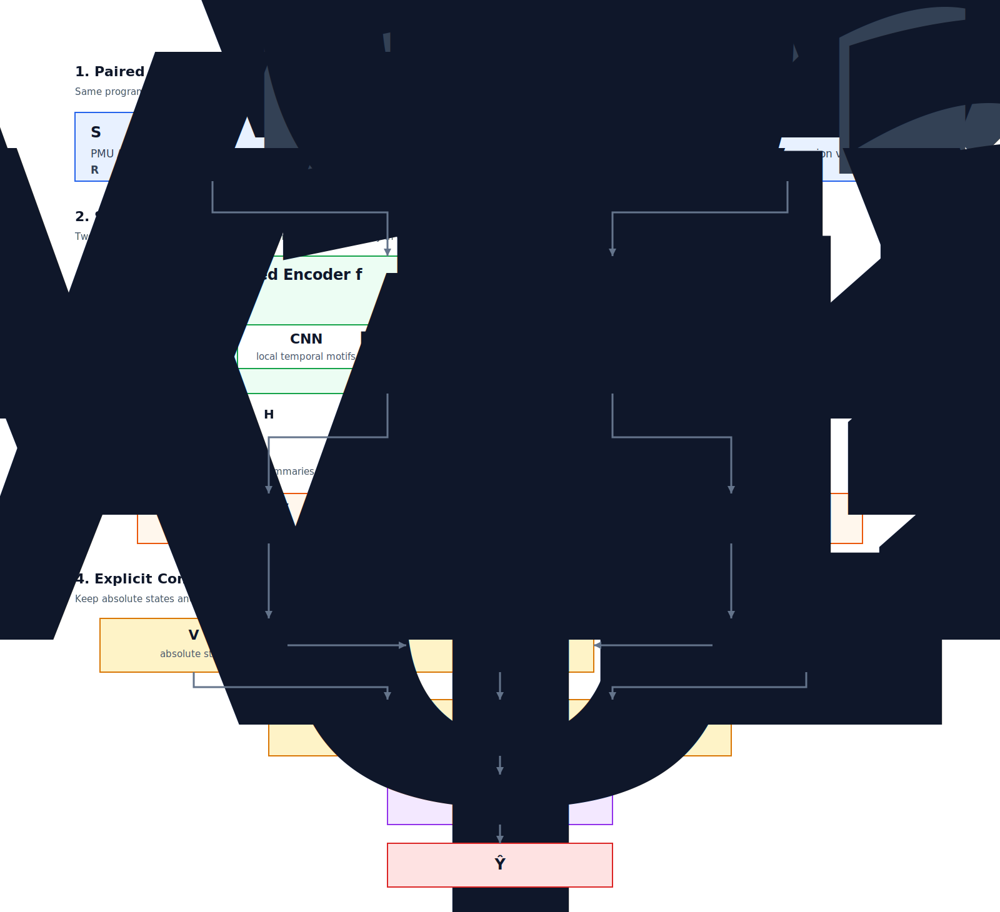

# Siamese-MicroPerf 模型架构详解

另外保留了一份 Mermaid 草图，见 [model-architecture.mmd](diagrams/model-architecture.mmd)。

## 总体视角

Siamese-MicroPerf 的核心任务不是单独判断一个版本“快不快”，而是判断同一个程序的两个版本之间谁更快、快多少。因此它不是一个普通的单塔时序回归器，而是一个显式面向“成对比较”的 Siamese 架构。

整体前向链路可以写成：

$$
(S_{v1}, S_{v2}) \rightarrow f_{\theta} \rightarrow \mathrm{Pool}(\cdot) \rightarrow [V_{v1}; V_{v2}; V_{v1} - V_{v2}] \rightarrow g_{\phi} \rightarrow \hat{Y}
$$

其中：

- $S_{v1}, S_{v2} \in \mathbb{R}^{T \times D}$ 是两个版本的 PMU/LBR 时序特征序列。
- $f_{\theta}$ 是共享参数的时序编码器。
- $\mathrm{Pool}(\cdot)$ 把时间维隐藏状态压缩成定长表示。
- $V_{v1}, V_{v2} \in \mathbb{R}^{H}$ 是两个版本的全局表示。
- 拼接向量 $[V_{v1}; V_{v2}; V_{v1} - V_{v2}] \in \mathbb{R}^{3H}$ 是显式对比特征。
- $g_{\phi}$ 是回归头，输出连续标量 $\hat{Y}$，表示版本 $v1$ 相对版本 $v2$ 的性能倍率预测。

这条链路的关键不在于“把两个序列都编码一遍”，而在于后续融合方式明确保留了两类信息：绝对状态和相对差异。

## 共享编码器：为什么必须共享参数

共享编码器的目标，是把两个版本的时序特征映射到同一个表示空间中。形式上可以写成：

$$
H_{v1} = f_{\theta}(S_{v1}), \qquad H_{v2} = f_{\theta}(S_{v2})
$$

其中 $H_{v1}, H_{v2} \in \mathbb{R}^{T \times H}$。

这里“共享”的意义不是简单的参数复用，而是保证比较本身有统一坐标系：

- 同一个 PMU/LBR 模式，在两个分支中会被映射为同类语义特征。
- 后续的 $V_{v1} - V_{v2}$ 才有稳定的物理意义，否则差分会落在两个不一致的嵌入空间上。
- 参数量更可控，训练数据利用率更高，也更符合“同一程序不同版本”的比较任务本质。

如果使用两套彼此独立的编码器，模型完全可能学到两套不同的内部语义标尺。那样即便最终回归器能工作，差分项也不再是清晰的“版本差异”，而更像是两套黑箱映射输出的偶然偏移。

## 共享编码器支持的三种 Backbone

### 1. CNN 编码器

CNN 分支适合提取局部时间窗口中的微结构模式，例如某一小段时间内连续出现的分支失误、iTLB 压力抬升、L1 I-cache 行为突变等。它的优势是：

- 局部模式感知强，适合捕捉短时间范围内反复出现的性能事件组合。
- 计算稳定，参数效率高。
- 对固定采样周期下的规律性模式比较敏感。

对于 PMU 序列来说，这类局部卷积特征往往对应“某种瓶颈在一段时间内重复出现”的现象。

### 2. LSTM 编码器

LSTM 分支强调顺序依赖与上下文传递，更适合描述程序执行阶段之间的时序过渡。例如：

- 某个版本是否在前半段就进入稳定状态。
- 某些异常分支行为是否会在后续时间段引发持续影响。
- 不同执行阶段之间是否存在明显的先后依赖。

双向 LSTM 还能同时利用前向与后向上下文，使每个时间步的表示不仅包含“过去发生了什么”，也包含“这一段最终演化成了什么状态”。

### 3. Transformer 编码器

Transformer 分支更强调长距离依赖和全局交互，适合处理那些相距较远但彼此相关的性能模式。例如：

- 早期 warm-up 阶段的特征，是否会影响后续稳态阶段的整体形态。
- 远距离出现的分支行为、缓存行为是否应被联合解释。
- 程序多个执行阶段之间是否存在跨时间段的全局依赖。

当序列较长、程序阶段性更复杂时，Transformer 的表达能力通常更强，但代价是计算量和训练敏感性也更高。

### 统一接口

不论底层使用 CNN、LSTM 还是 Transformer，编码器输出都会被规范成统一的隐藏状态序列 $H \in \mathbb{R}^{T \times H}$。这意味着下游的池化层、融合层和回归头不需要感知底层架构细节，只需要消费统一的时序表示即可。

这也是仓库中通过模型工厂切换不同 backbone 的根本原因：编码器可以替换，但比较接口不变。

## Pooling：从时序隐藏状态到版本级表示

编码器输出的是整段时间序列上的隐藏状态，但最终比较任务需要的是版本级的紧凑表示。因此模型需要把：

$$
H_{v1}, H_{v2} \in \mathbb{R}^{T \times H}
$$

压缩为：

$$
V_{v1}, V_{v2} \in \mathbb{R}^{H}
$$

在这个项目里，Pooling 不是简单的“随便平均一下”，而是带有 mask 感知的聚合过程。它的作用主要有三点：

- 把整段序列压缩成可比较的定长向量。
- 在变长序列场景下忽略 padding 区域，避免无效时间步污染表示。
- 让模型能够自动突出更有判别力的时间片段，而不是把所有时间步等权看待。

因此，$V_{v1}$ 和 $V_{v2}$ 可以理解为“两个版本各自最能代表整体执行行为的全局摘要”。

## 核心设计：为什么要用 [V_{v1}; V_{v2}; V_{v1} - V_{v2}]

这是整个 Siamese-MicroPerf 架构里最关键的设计之一。

设池化后得到两个版本表示：

$$
V_{v1}, V_{v2} \in \mathbb{R}^{H}
$$

模型并不是只把它们做差，也不是只把它们简单拼接，而是构造：

$$
Z = [V_{v1}; V_{v2}; V_{v1} - V_{v2}]
$$

这个设计显式保留了三层信息。

### 1. 保留版本 1 的绝对状态

$V_{v1}$ 记录的是版本 $v1$ 本身的整体执行画像。它告诉回归头：

- 当前被放在分子位置的版本，本身处于怎样的微架构状态。
- 它的 PMU/LBR 轨迹总体上更像“高吞吐版本”还是“高阻力版本”。

如果没有这一项，模型只能看到差异，但看不到“差异发生在什么基线之上”。

### 2. 保留版本 2 的绝对状态

$V_{v2}$ 提供比较对象的全局画像。它的作用与 $V_{v1}$ 对称，但语义上并不冗余，因为该任务本身是有方向的：模型预测的是“$v1$ 相对 $v2$ 的倍率”，而不是无方向的相似度分数。

保留 $V_{v2}$ 之后，回归头可以区分下面这两类情况：

- $v1$ 很强，而 $v2$ 一般。
- $v2$ 很弱，导致同样的差值看起来更大。

这两种情形的 $V_{v1} - V_{v2}$ 可能接近，但物理解释和倍率尺度并不相同。

### 3. 显式保留方向性差分

$V_{v1} - V_{v2}$ 是整个融合向量中最直接的对比信号。它把“两个版本在哪些维度上不同、差多少、方向如何”显式交给回归头，而不是要求 MLP 自己从拼接向量里去隐式学习减法。

这个差分项带来三点直接收益：

- 它让版本差异以显式、线性的方式出现在输入中。
- 它天然保留方向信息，交换 $v1$ 和 $v2$ 后符号会翻转。
- 它降低了回归头的学习负担，使模型更容易聚焦真正的性能差异轴。

换句话说，差分项是“比较”这件事的直接编码。

## 为什么不能只用差分，或者只用拼接

### 只用差分的问题

如果只使用：

$$
V_{v1} - V_{v2}
$$

模型确实能看到差异，但会丢掉两个版本各自的绝对位置。这样会导致一个问题：相同的差值，可能对应完全不同的全局运行状态。

例如：

- 一组样本可能是“两个版本都很好，但 $v1$ 稍好一点”。
- 另一组样本可能是“两个版本都很差，只是 $v2$ 更差”。

这两类样本的差分可能相似，但它们对应的性能倍率、稳定性和泛化语义并不相同。

### 只用拼接的问题

如果只使用：

$$
[V_{v1}; V_{v2}]
$$

模型理论上也可以自己学会做减法，但这会把本可以明确表达的对比关系，变成一个额外的隐式学习任务。这样通常会带来两类代价：

- 学习效率更低，因为回归头需要自己推断哪些维度值得相减。
- 对小样本或噪声数据更敏感，因为关键对比结构没有被显式编码。

因此，$[V_{v1}; V_{v2}; V_{v1} - V_{v2}]$ 的本质，是同时保留“状态”和“变化”。它既告诉模型两个版本分别是谁，也告诉模型它们到底差在哪里。

## 完整前向链路逐步拆解

下面按公式顺序展开整个架构。

### 第一步：输入成对时序特征

两个版本的输入分别是：

$$
S_{v1}, S_{v2} \in \mathbb{R}^{T \times D}
$$

这里的 $D$ 是每个时间步的特征维度，通常由 PMU 派生特征和 LBR 特征组成；$T$ 是时间长度。输入序列已经完成了基础对齐与标准化，因此模型处理的是“同一程序、不同版本”的时序行为差异。

### 第二步：共享编码器提取高层时序表示

两个输入分别经过同一个编码器：

$$
H_{v1} = f_{\theta}(S_{v1}), \qquad H_{v2} = f_{\theta}(S_{v2})
$$

得到隐藏状态序列后，模型已经不再停留在原始 MPKI 或 LBR 数值层面，而是进入“可比较的行为表示层”。此时每个时间步的向量都在表达更抽象的执行状态，例如局部瓶颈模式、阶段切换特征或全局依赖关系。

### 第三步：Pooling 提炼版本级摘要

时序隐藏状态再经过池化：

$$
V_{v1} = \mathrm{Pool}(H_{v1}), \qquad V_{v2} = \mathrm{Pool}(H_{v2})
$$

这一步的结果是把“整段时间上的动态行为”浓缩成“一个版本的全局表示”。

可以把 $V_{v1}$ 和 $V_{v2}$ 理解成两个版本各自的执行画像：它们不是单一时间点的状态，而是整段运行轨迹压缩后的高层摘要。

### 第四步：显式构造对比融合向量

这是从“表示学习”进入“比较学习”的分界点：

$$
Z = [V_{v1}; V_{v2}; V_{v1} - V_{v2}]
$$

从这一刻开始，模型拿到的就不是两个独立向量，而是一个已经显式注入比较关系的融合表示。回归头不需要再自己猜测“应该如何比较这两个版本”，因为差分项已经把比较方向明确写进输入里了。

### 第五步：回归头输出倍率预测

最后由 MLP 回归头完成映射：

$$
\hat{Y} = g_{\phi}(Z)
$$

$\hat{Y}$ 是连续值，表示版本 $v1$ 相对版本 $v2$ 的性能倍率预测。于是：

- 当 $\hat{Y} > 1$ 时，模型判断 $v1$ 更快。
- 当 $\hat{Y} < 1$ 时，模型判断 $v2$ 更快。
- 当 $\hat{Y}$ 接近 $1$ 时，说明两个版本在模型看来性能差异较小。

## 这条架构的工程意义

这套架构把任务拆成了四个层次清晰的阶段：

1. 共享编码器负责把原始 PMU/LBR 序列转换成可比较的高层表示。
2. Pooling 负责把时序动态压缩成版本级摘要。
3. 显式对比融合负责把“谁是谁”以及“差在哪里”同时交给回归头。
4. 回归头负责把融合后的对比特征映射为最终的性能倍率。

其中最重要的设计不是单独某个 backbone，而是整个比较接口：

$$
[V_{v1}; V_{v2}; V_{v1} - V_{v2}]
$$

它确保模型既能看到两个版本各自的绝对状态，又能直接读取它们的方向性差异。这正是 Siamese-MicroPerf 能把“时序行为建模”变成“相对性能预测”的关键。

## 相关资料

- 根目录说明可参考 [README](../README.md)
- 现有前向图示可参考 [forward_sequence.svg](diagrams/forward_sequence.svg)
- 交互式图示可参考 [forward_sequence.html](diagrams/forward_sequence.html)