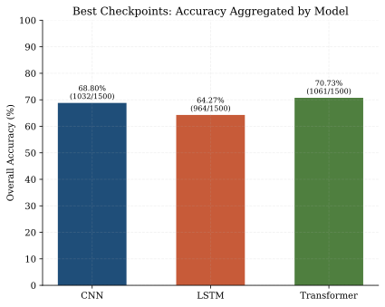
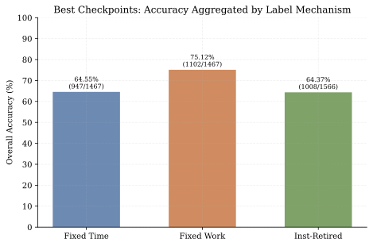
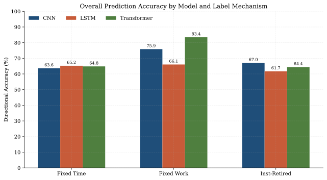
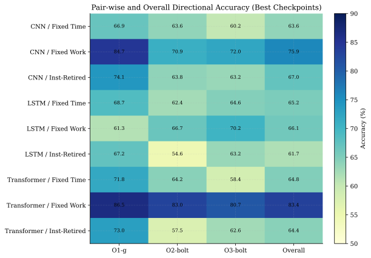
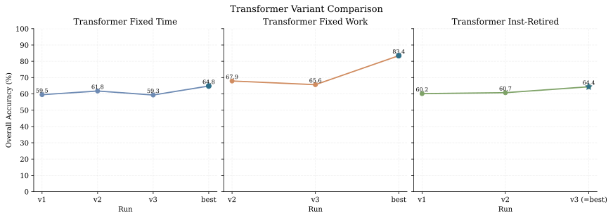

# Overall Prediction Accuracy

本文汇总了 [checkpoints](../checkpoints/) 目录下所有推理日志中的“方向准确率”，并给出统一口径的 overall prediction accuracy。

## 计算口径

每个 infer 日志里都会按三组程序对比输出三次“方向准确率”，当前日志顺序一致，分别对应：

- O1-g
- O2-bolt
- O3-bolt

本文的 overall prediction accuracy 定义为：

$$
\mathrm{Overall\ Accuracy} = \frac{\sum_i \mathrm{correct}_i}{\sum_i \mathrm{total}_i}
$$

也就是说，不直接对三个百分比做算术平均，而是先把三组对比的正确数与样本数相加，再计算加权后的总体准确率。

需要注意两点：

- `fixed_time` 与 `fixed_work` 日志的总样本数通常是 $163 + 165 + 161 = 489$。
- `inst` 系列日志的总样本数通常是 $174 + 174 + 174 = 522$。

因此，不同标签机制之间比较 overall accuracy 时，应该以“正确数/总数”的加权结果为准。

## 主结果：best checkpoint

下面这张表只统计各模型目录下带有 `best` 标记的正式结果。

| Model | Label | O1-g | O2-bolt | O3-bolt | Overall | Source |
| --- | --- | --- | --- | --- | --- | --- |
| CNN | fixed_time | 109/163 (66.9%) | 105/165 (63.6%) | 97/161 (60.2%) | 311/489 (63.60%) | [cnn/fixed_time_best/infer_20260330_213616.log](../checkpoints/cnn/fixed_time_best/infer_20260330_213616.log) |
| CNN | fixed_work | 138/163 (84.7%) | 117/165 (70.9%) | 116/161 (72.0%) | 371/489 (75.87%) | [cnn/fixed_work_best/infer_20260330_211323.log](../checkpoints/cnn/fixed_work_best/infer_20260330_211323.log) |
| CNN | inst | 129/174 (74.1%) | 111/174 (63.8%) | 110/174 (63.2%) | 350/522 (67.05%) | [cnn/inst_best/infer_20260330_230630.log](../checkpoints/cnn/inst_best/infer_20260330_230630.log) |
| LSTM | fixed_time | 112/163 (68.7%) | 103/165 (62.4%) | 104/161 (64.6%) | 319/489 (65.24%) | [lstm/fixed_time_best/infer_20260331_142207.log](../checkpoints/lstm/fixed_time_best/infer_20260331_142207.log) |
| LSTM | fixed_work | 100/163 (61.3%) | 110/165 (66.7%) | 113/161 (70.2%) | 323/489 (66.05%) | [lstm/fixed_work_best/infer_20260331_145944.log](../checkpoints/lstm/fixed_work_best/infer_20260331_145944.log) |
| LSTM | inst | 117/174 (67.2%) | 95/174 (54.6%) | 110/174 (63.2%) | 322/522 (61.69%) | [lstm/inst_best/infer_20260331_162147.log](../checkpoints/lstm/inst_best/infer_20260331_162147.log) |
| Transformer | fixed_time | 117/163 (71.8%) | 106/165 (64.2%) | 94/161 (58.4%) | 317/489 (64.83%) | [transformer/fixed_time_best/infer_20260331_202350.log](../checkpoints/transformer/fixed_time_best/infer_20260331_202350.log) |
| Transformer | fixed_work | 141/163 (86.5%) | 137/165 (83.0%) | 130/161 (80.7%) | 408/489 (83.44%) | [transformer/fixed_work_best/infer_20260330_154532.log](../checkpoints/transformer/fixed_work_best/infer_20260330_154532.log) |
| Transformer | inst | 127/174 (73.0%) | 100/174 (57.5%) | 109/174 (62.6%) | 336/522 (64.37%) | [transformer/inst_best/infer_20260331_174437.log](../checkpoints/transformer/inst_best/infer_20260331_174437.log) |

从 best checkpoint 看，最强单项结果是 Transformer 的 `fixed_work`，overall prediction accuracy 为 $408/489 = 83.44\%$。

## 聚合视角

### 按模型聚合（仅统计 best checkpoint）

| Model | Correct / Total | Overall Accuracy |
| --- | --- | --- |
| CNN | 1032 / 1500 | 68.80% |
| LSTM | 964 / 1500 | 64.27% |
| Transformer | 1061 / 1500 | 70.73% |

### 按标签机制聚合（仅统计 best checkpoint）

| Label | Correct / Total | Overall Accuracy |
| --- | --- | --- |
| fixed_time | 947 / 1467 | 64.55% |
| fixed_work | 1102 / 1467 | 75.12% |
| inst | 1008 / 1566 | 64.37% |

### 全部 best checkpoint 合并

将上表 9 个 best infer 日志全部合并后：

- Overall prediction accuracy = 3057 / 4500 = 67.93%

这个数字最适合作为当前仓库“正式保留模型结果”的总览指标。

## 论文图表

下面三张图已经从当前 checkpoints 日志自动生成，文件位于 [docs/diagrams](diagrams)。

为避免视觉误导，所有百分比图的纵轴都按 0% 到 100% 绘制，不再使用截断纵轴。

### 图 1：best checkpoint 的总体准确率对比

这张图适合在正文里直接回答“不同模型在不同标签机制上的 overall prediction accuracy 如何变化”。

### 图 2：best checkpoint 的分任务热力图

这张图更适合支撑分析段落，因为它同时保留了 O1-g、O2-bolt、O3-bolt 和 overall 四列信息。

## 补充：Transformer 版本试验

`transformer` 目录下还保留了一些版本试验日志。它们更适合拿来做横向比较，不建议与主表中的 `best` 结果混为一谈。

| Run | Correct / Total | Overall Accuracy | Source |
| --- | --- | --- | --- |
| fixed_timev1 | 291 / 489 | 59.51% | [transformer/fixed_timev1/infer_20260331_193632.log](../checkpoints/transformer/fixed_timev1/infer_20260331_193632.log) |
| fixed_timev2 | 302 / 489 | 61.76% | [transformer/fixed_timev2/infer_20260331_201750.log](../checkpoints/transformer/fixed_timev2/infer_20260331_201750.log) |
| fixed_timev3 | 290 / 489 | 59.30% | [transformer/fixed_timev3/infer_v3.txt](../checkpoints/transformer/fixed_timev3/infer_v3.txt) |
| fixed_workv2 | 332 / 489 | 67.89% | [transformer/fixed_workv2/infer_v2.log](../checkpoints/transformer/fixed_workv2/infer_v2.log) |
| fixed_workv3 | 321 / 489 | 65.64% | [transformer/fixed_workv3/infer_v3.log](../checkpoints/transformer/fixed_workv3/infer_v3.log) |
| inst_retiredv1 | 314 / 522 | 60.15% | [transformer/inst_retiredv1/infer_20260330_192629.txt](../checkpoints/transformer/inst_retiredv1/infer_20260330_192629.txt) |
| inst_retiredv2 | 317 / 522 | 60.73% | [transformer/inst_retiredv2/infer_20260331_172047.log](../checkpoints/transformer/inst_retiredv2/infer_20260331_172047.log) |
| inst_retiredv3 | 336 / 522 | 64.37% | [transformer/inst_retiredv3/infer_20260331_174437.log](../checkpoints/transformer/inst_retiredv3/infer_20260331_174437.log) |

从这些试验版本看：

- `fixed_time` 方向上，`fixed_time_best` 明显优于 v1、v2、v3。
- `fixed_work` 方向上，`fixed_work_best` 仍然显著领先 v2、v3。
- `inst` 方向上，最终保留的 `inst_best` 与 `inst_retiredv3` 处于当前 Transformer 试验中的较优水平。

### 图 3：Transformer 版本试验对比

这张图适合放在 ablation 或 training evolution 小节里，用来说明不同版本试验与最终 best 结果之间的差距。

补充说明：在当前归档结果中，Transformer 的 `inst_retiredv3` 与 `inst_best` overall accuracy 数值相同，因此图中将它们合并为一个点 `v3 (=best)`，避免重复绘制造成歧义。

## 所有 infer 日志的总合并结果

如果把 [checkpoints](../checkpoints/) 下当前保留的 17 个 infer 日志全部合并，包括所有试验版与 best 版，则：

- Overall prediction accuracy = 5560 / 8511 = 65.33%

这个数字反映的是“整个 checkpoints 目录里所有保留推理结果的总体表现”，但它混合了正式 best 结果和历史试验版本，因此更适合作为仓库归档视角，而不是最终对外结论。

## 结论

如果只保留一个最有代表性的总体指标，建议使用：

- best checkpoint overall prediction accuracy = 3057 / 4500 = 67.93%

如果只保留一个最强单模型结果，建议使用：

- Transformer fixed_work overall prediction accuracy = 408 / 489 = 83.44%